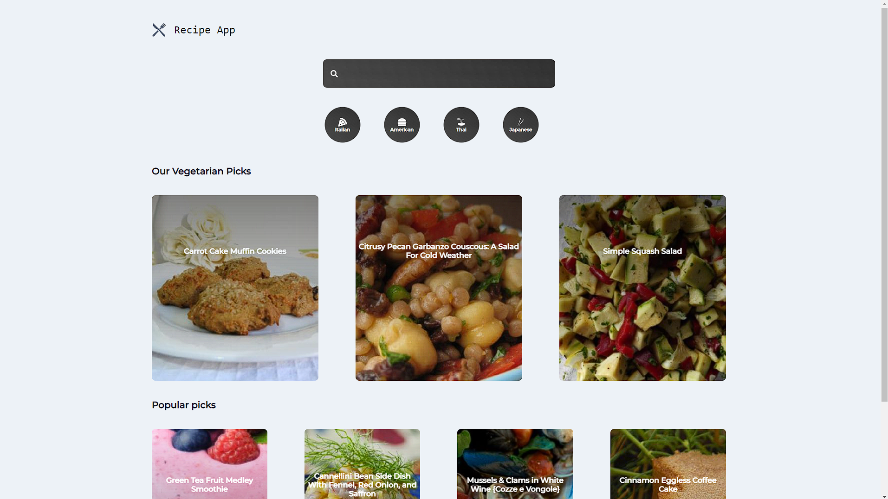

# What is this App about?

It is a restaurant and recipe App that lets you showcase your restaurants information, chefs and have full contact information with a message box. It has a defined category of food menus which that restaurant servers. It also shows the recipe of the menu and how they actually make it.

# What technologies were used?

- Reactjs
- NPM packages as:
  - Styled-components for using the CSS inside the JSX.
  - react-bootstrap
  - React-router-dom for the routes of the App.
  - Framer-motion for animations when changing pages.
  - React icons.
